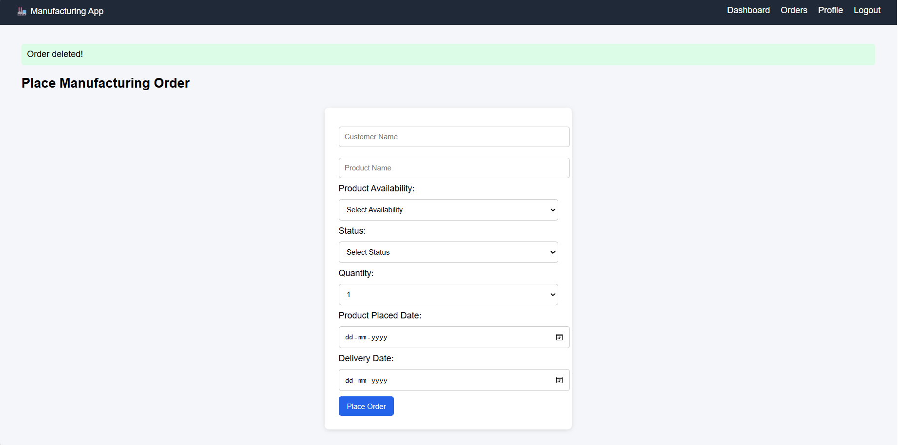

Manufacturing Management App

Overview

The Manufacturing Management App is a modular, end-to-end platform designed to help manufacturing businesses digitally manage their production processes. It replaces fragmented spreadsheets and manual tracking with a centralized, user-friendly application. Users can create, track, and manage manufacturing orders, work orders, stock, and bills of materials efficiently.

Features

Authentication

User registration and login.

Role-based access (Admin, Manager, Operator).

Password hashing for security.

OTP verification for password reset (optional enhancement).

Dashboard

Real-time list of all manufacturing orders.

Quick KPIs: Total orders, In-progress, Completed, Delayed.

Filter orders by status.

Manufacturing Orders

Create, edit, and delete orders.

Track product availability and order status.

Manage quantity, placed date, and delivery date.

Link BOM to manufacturing orders.

Work Orders

Assign tasks to operators.

Track status updates (Planned, Started, Paused, Completed).

Capture comments, issues, and delays.

Work Centers

Manage machines and locations.

Track capacity, downtime, and utilization.

Costing per hour for each work center.

Stock Management

Track raw material and finished goods movement.

Automatic stock updates after work order completion.

Maintain stock ledger.

Bills of Materials (BOM)

Define material requirements per finished product.

Link components to manufacturing orders.

Profile & Reports

User profile management.

View completed tasks and total work duration.

Exportable reports in Excel or PDF.

Tech Stack

Backend: Python, Flask, SQLAlchemy

Frontend: HTML, CSS, Jinja2 Templates

Database: SQLite

Authentication: Flask-Login

Security: Werkzeug (Password Hashing)

Installation

Clone the repository

git clone <https://github.com/yuvasri-18/Manufacturing>
cd manufacturing-app

Create and activate virtual environment

python -m venv venv
# Windows

Install dependencies

pip install -r requirements.txt

Create database

python
>>> from app import db, app
>>> with app.app_context():
...     db.create_all()
... 
>>> exit()

Run the application

python app.py

Open your browser and go to:

http://127.0.0.1:5000/

Usage

Sign up as a new user.

Log in and navigate the dashboard.

Place new manufacturing orders and assign work orders.

Manage stock, BOMs, and work centers.

Edit or delete orders as needed.

Export reports for analysis.

Project Structure

manufacturing-app/
│
├─ app.py             

├─ config.py             

├─ requirements.txt      

├─ templates/      

│   ├─ base.html

│   ├─ login.html

│   ├─ signup.html

│   ├─ dashboard.html

│   ├─ orders.html

│   ├─ edit_order.html

│   ├─ work_orders.html

│   ├─ work_centers.html

│   ├─ stock.html

│   ├─ bom.html

│   └─ profile.html

├─ static/   

└─ README.md

Screenshots

Future Enhancements

Add Quality Check module.

Enable Maintenance scheduling.

Implement notifications for delayed orders.

Multi-user collaboration with role-specific dashboards.

License

This project is licensed under the MIT License.